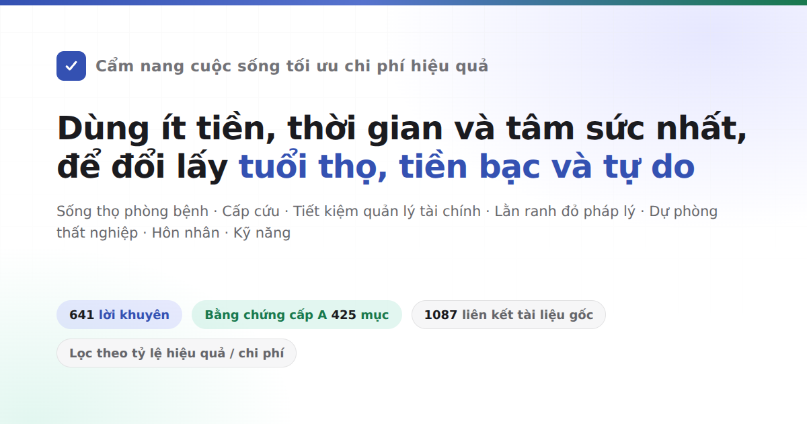

<div align="center">



# Cẩm nang cuộc sống tối ưu chi phí hiệu quả

Nói về cách sống thọ, cách ít mắc bệnh, khi gặp tai nạn thì sơ cứu thế nào. Nói về cách bớt tiêu tiền oan, những việc gì dễ bị lừa đảo hay vướng vào kiện tụng lao lý. Nói về khi thất nghiệp, cạn tiền thì có thể nhận những khoản trợ cấp nào và tìm đến đâu; mở cửa hàng, lập công ty, làm trang web cần làm những thủ tục gì. Cũng nói về chuyện yêu đương, kết hôn, sinh con, du học và học nghề.<br>
641 lời khuyên thực tiễn, mỗi mục đều nêu rõ phải bỏ ra những gì, thu về được gì, bằng chứng vững chắc đến đâu, nguồn trích dẫn hoàn toàn từ các bài báo khoa học bình duyệt và văn bản chính thức của cơ quan nhà nước.

Không cần làm theo tất cả: Đây là danh sách các lựa chọn đã được xếp hạng theo tỷ lệ hiệu quả/chi phí, không phải bảng việc cần làm — chỉ cần chọn và thực hiện 1 hoặc 2 điều là đã có ý nghĩa, bản thân tác giả cũng chưa làm được phần lớn trong số này.

[](https://Gaorb80.github.io/HowToLiveBetter/)
[](#mục-lục)
[](#phân-cấp-bằng-chứng)
[](docs/ho-so-kiem-chung/)
[](#giấy-phép-bản-quyền)

### [Mở trang tra cứu trực tuyến](https://Gaorb80.github.io/HowToLiveBetter/) · [Trợ lý AI tra cứu sách (skill)](skills/life-decision-guide/README.md)

Skill AI hỗ trợ cả Claude Code và Codex / Antigravity. Sau khi cài đặt, hỏi trực tiếp "Bạn nhờ đứng ra bảo lãnh vay tiền, có nên ký không", AI sẽ tra cứu điều mục trong sách trước rồi mới trả lời, kèm theo chú thích rõ xuất xứ từ Mục mấy Chương mấy.

<table>
<tr><td align="right"><b>Tải về</b></td><td align="left">

[PDF](https://github.com/Gaorb80/HowToLiveBetter/releases/download/epub-latest/HowToLiveBetter.pdf) · [EPUB](https://github.com/Gaorb80/HowToLiveBetter/releases/download/epub-latest/HowToLiveBetter.epub) · [Bản ngoại tuyến một tệp (HTML)](https://github.com/Gaorb80/HowToLiveBetter/releases/download/epub-latest/HowToLiveBetter.html)

</td></tr>
<tr><td align="right"><b>Tra cứu</b></td><td align="left">

[Mục lục](#mục-lục) · [Bảng thuật ngữ](#đọc-hiểu-các-con-số-bảng-chú-giải-thuật-ngữ) · [Hồ sơ thẩm định](docs/ho-so-kiem-chung/)

</td></tr>
<tr><td align="right"><b>Bài viết chuyên sâu</b></td><td align="left">

[Kết hôn có đáng không](docs/ket-hon-co-dang-khong.md) · [Danh sách trang bị khẩn cấp cho gia đình](docs/danh-sach-trang-bi-khan-cap-gia-dinh.md) · [Gặp người lạ bị nạn có nên dừng lại cứu](docs/co-nen-dung-lai-giup-nguoi-la-bi-nan.md) · [Làm nền tảng web cần giấy phép gì](docs/lam-nen-tang-can-nhung-giay-phep-gi.md) · [Đồng hồ sinh học và làm ca đêm](docs/dong-ho-sinh-hoc-va-ca-dem.md)

</td></tr>
<tr><td align="right"><b>Ngôn ngữ khác</b></td><td align="left">

[Tiếng Trung (bản gốc)](https://eternity4719.github.io/HowToLiveBetter/) · [English](https://dlgrv.github.io/HowToLiveBetter/en/) · [Русский](https://dlgrv.github.io/HowToLiveBetter/ru/) · [Español](https://dlgrv.github.io/HowToLiveBetter/es/) · [Português](https://dlgrv.github.io/HowToLiveBetter/pt/)

</td></tr>
</table>

</div>

---

## Những câu hỏi cuốn sách muốn trả lời

| Câu hỏi | Xem ở đâu |
| --- | --- |
| Hầu như không tốn tiền mà giảm rõ rệt nguy cơ chết sớm gồm những việc gì? | [1. Đừng chết sớm](book/01-dung-chet-som.md) |
| Hút thuốc, uống rượu, ngồi lâu, thức đêm thực sự làm giảm bao nhiêu tuổi thọ, cai thuốc cai rượu cụ thể thế nào, dầu ăn gia đình chọn và dùng ra sao? | [2. Đừng chết dần chết mòn](book/02-dung-chet-dan-chet-mon.md) |
| Mỗi ngày năng lượng không đủ dùng, liên tục bị ngắt quãng, sửa thế nào? | [3. Đừng lãng phí tâm sức](book/03-dung-lang-phi-tam-suc.md) |
| Thời gian đã trôi đi đâu, làm sao bớt làm việc vô ích, trị bệnh trì hoãn thế nào? | [4. Đừng lãng phí thời gian](book/04-dung-lang-phi-thoi-gian.md) |
| Tiền tích lũy nên để ở đâu để không bị lãi suất, phí quản lý và lừa đảo bào mòn? | [5. Đừng lãng phí tiền bạc](book/05-dung-lang-phi-tien-bac.md) |
| Những thực phẩm chức năng, gói khám sức khỏe, thuế IQ nào có thể bỏ qua ngay? | [6. Danh sách những điều không nên làm](book/06-danh-sach-nhung-dieu-khong-nen-lam.md) |
| Thất nghiệp, bị nợ lương, trong người hết tiền, nhận trợ cấp gì và tìm ai giúp? | [7. Khi không có tiền thì sống thế nào](book/07-khi-khong-co-tien-thi-song-the-nao.md) |
| Sính lễ, nhà trước hôn nhân, chuyển tiền khi yêu tính của ai; bị tố cáo hay vu khống thì bước đầu tiên làm gì; lỡ gây chuyện tự thú được giảm bao nhiêu án? | [8. An toàn pháp lý và tài sản](book/08-dung-de-ban-than-roi-vao-bay-nguy-hiem.md) |
| Những công việc "làm thêm" hay việc tiện tay nào dễ khiến người bình thường vướng vòng lao lý? | [9. Lằn ranh đỏ pháp lý người bình thường dễ mắc phải](book/09-lan-ranh-do-phap-ly-nguoi-binh-thuong-de-mac-phai.md) |
| Tán tỉnh nên mở rộng hay theo đuổi một người, yêu xa có thành không, đăng ký kết hôn cần mang gì? | [10. Yêu đương và kết hôn có đáng không](book/10-yeu-duong-va-ket-hon-co-dang-khong.md) |
| Viết những đoạn code nào, nhận những dự án nào có thể bị kết án tù? | [11. Lằn ranh đỏ cho lập trình viên và dân công nghệ](book/11-lan-ranh-do-cho-lap-trinh-vien-va-dan-cong-nghe.md) |
| Vay tiền mở quán, mở công ty trước hết cần nghĩ thông suốt điều gì? | [12. Khởi nghiệp và kinh doanh](book/12-khoi-nghiep-va-kinh-doanh.md) |
| Có người ngã gục ngừng thở, chảy máu lớn, hỏa hoạn, lạc đường, sơ cứu gì trước tiên? | [13. Xử lý tình huống khẩn cấp và sơ cấp cứu](book/13-xu-ly-tinh-huong-khan-cap-va-so-cap-cuu.md) |
| Tài khoản bị hack, mất điện thoại, bước đầu tiên làm gì? | [14. Bảo mật tài khoản và an toàn thông tin](book/14-bao-mat-tai-khoan-va-an-toan-thong-tin.md) |
| Bị trừ tiền cọc, chủ nhà đuổi, công ty thuê trọ vỡ nợ làm sao; muốn về quê sống có mua được đất nông thôn không? | [15. Thuê nhà và mua nhà](book/15-thue-nha-va-mua-nha.md) |
| Sau khi phát hiện bệnh mãn tính, quản lý dài hạn ra sao để ít tốn kém nhất? | [16. Sống chung với bệnh mãn tính](book/16-song-the-nao-sau-khi-mac-benh-man-tinh.md) |
| Việc giám hộ, di chúc và tiền bạc của người già trong nhà nên thu xếp trước thế nào? | [17. Khi trong nhà có người cao tuổi](book/17-khi-trong-nha-co-nguoi-cao-tuoi.md) |
| Sinh con nhận được khoản gì, chiếm mất bao nhiêu thời gian và tiền bạc? | [18. Nuôi con có kinh tế không](book/18-nuoi-con-co-kinh-te-khong.md) |
| Tiền làm thêm giờ, phép năm tính thế nào; bị sa thải nhận bồi thường bao nhiêu; bị tai nạn lao động khai báo ra sao? | [19. Đi làm, nghỉ việc và tai nạn lao động](book/19-di-lam-nghi-viec-va-tai-nan-lao-dong.md) |
| Em bé vừa chào đời, những việc quan trọng nhất cần làm là gì? | [20. Cách chăm sóc trẻ sơ sinh](book/20-cach-cham-soc-tre-so-sinh.md) |
| Quốc gia nào hiện không nên đi, xảy ra sự cố thì đại sứ quán hỗ trợ đến đâu? | [21. Du lịch nước ngoài và an toàn xuất ngoại](book/21-du-lich-nuoc-ngoai-va-an-toan-xuat-ngoai.md) |
| Đi hát karaoke, quán net, phòng thoát hiểm tránh bẫy thế nào; lúc stress làm gì hiệu quả nhất? | [22. Thư giãn đúng cách: Giải trí và giải tỏa áp lực](book/22-thu-gian-the-nao-cho-dung.md) |
| Học hàn xì, học tiếng Anh, thi chứng chỉ, cái nào thực sự sinh lời; học thế nào tiết kiệm thời gian nhất? | [23. Học kỹ năng gì đáng giá nhất](book/23-hoc-ky-nang-gi-dang-gia-nhat.md) |
| Cùng một bệnh khám ở trạm y tế và viện tuyến trên chênh nhau bao nhiêu tiền; bị thương nặng xếp hàng hay vào thẳng bàn phân loại cấp cứu? | [24. Khám và chữa bệnh: Ít tốn tiền, ít đi đường vòng](book/24-kham-va-chua-benh.md) |
| Người thân qua đời, lúc đó làm gì trước, tiền nào rút lại được, chi phí nào có thể không phải đóng? | [25. Những việc cần làm sau khi người thân qua đời](book/25-nhung-viec-can-lam-sau-khi-nguoi-than-qua-doi.md) |
| Làm trang web hay nền tảng thu tiền người dùng cần giấy phép gì, máy chủ đặt ở đâu? | [26. Xây dựng website hoặc nền tảng số](book/26-xay-dung-mot-trang-web-hoac-nen-tang.md) |
| Mang thai, chuẩn bị sinh con, thời điểm nào làm gì, trước khi xuất viện làm giấy tờ gì? | [27. Mang thai và sinh con](book/27-mang-thai-va-sinh-con.md) |
| Muốn giảm cân, muốn đẹp hơn, những cách làm nào sẽ tàn phá cơ thể? | [28. Đừng vì ngoại hình mà làm hỏng cơ thể](book/28-dung-vi-ngoai-hinh-ma-lam-hong-co-the.md) |
| Người thân mất, bị mất việc, nhận chẩn đoán bệnh hiểm nghèo, mấy tháng đầu việc gì quan trọng nhất? | [29. Sau khi gặp phải cú sốc lớn](book/29-sau-khi-gap-phai-cu-soc-lon.md) |
| Con đi học rồi, những vấn đề thể chất và tâm lý nào không thể chờ đến khi thi xong mới xử lý? | [30. Nuôi dạy con sau khi đi học](book/30-nuoi-day-con-sau-khi-di-hoc.md) |
| Sau 18 tuổi ngoài học đại học và đi làm thuê còn có những ngã rẽ nào, điều kiện từng con đường ra sao? | [31. Sau 18 tuổi có những con đường nào](book/31-sau-18-tuoi-co-nhung-con-duong-nao.md) |
| Đi du học, visa thế nào để không bị gián đoạn, bằng cấp về nước có được công nhận không? | [32. Du học nước ngoài: Tư cách lưu trú, làm thêm, bảo hiểm và công nhận văn bằng](book/32-du-hoc-nuoc-ngoai.md) |
| Bản thân hoặc người nhà bị khuyết tật, phòng ngừa biến chứng nào trước, xin trợ cấp gì, đi học, đi làm ra sao? | [33. Sống thế nào sau khi bị khuyết tật](book/33-song-the-nao-sau-khi-bi-khuyet-tat.md) |
| Thuốc cảm, hạ sốt, đau dạ dày tự mua uống, loại nào không được uống chung, trẻ nhỏ, phụ nữ mang thai và người già cần tránh những gì? | [34. Sử dụng thuốc tủ gia đình an toàn](book/34-thuoc-du-phong-gia-dinh-dung-uong-bua-gay-hoa.md) |

## Cách đọc sách

- **Không cần làm theo tất cả**: Đây là danh sách các lựa chọn đã xếp theo hiệu quả chi phí, không phải bảng việc bắt buộc. Chỉ cần chọn làm 1 hoặc 2 điều là đủ, những điều còn lại để đó khi cần tra cứu sau. Tác giả cũng không làm được hết mọi điều, viết ra là để khi cần có chỗ tìm thấy ngay.
- **Dùng trợ lý AI tra cứu giúp bạn**: Kho lưu trữ tích hợp sẵn skill tiếng Việt / đa ngôn ngữ ([skills/life-decision-guide](skills/life-decision-guide/)), dùng được cho cả Claude Code và Codex / Antigravity.
- **Lọc theo điều kiện**: Mở [Trang tra cứu trực tuyến](https://Gaorb80.github.io/HowToLiveBetter/), có thể lọc theo từ khóa, chương sách, cấp bằng chứng, hoặc lọc theo 3 trục chi phí: "Có tốn tiền không, tốn bao nhiêu thời gian, có cần nhiều ý chí không".
- **Liên kết chéo giữa các mục** (ví dụ "Xem Mục 17 Chương 8"): Trên trang tra cứu, liên kết chéo có gạch chân đứt nét, bấm vào sẽ hiển thị nhanh nội dung tóm tắt của mục đó.
- **Nếu không hiểu các thuật ngữ thống kê**: Mỗi mục đều có phần "Giải thích dễ hiểu" diễn giải bằng ngôn ngữ đời thường ngắn gọn, không dùng thuật ngữ rườm rà.
- **Chỉ muốn xem những kết luận vững chắc nhất**: Chọn lọc bằng chứng cấp A để xem 425 mục đến từ các phân tích gộp (meta-analysis) hoặc thử nghiệm lâm sàng ngẫu nhiên lớn.
- **Chỉ muốn xem những điều đáng làm nhất**: Chọn mức hiệu quả chi phí "Rất cao" để nhận 109 mục vừa không tốn tiền, không tốn thời gian, không cần ý chí, mà lợi ích lại ở mức cao nhất.

Cấu trúc mỗi mục lời khuyên như sau:

```markdown
### 5. Đổi muối ăn trong nhà sang muối ít natri (muối kali)
<!-- Nhãn chi phí: Tiền=Ít Thời_gian=Ít Ý_chí=Không Lợi_ích=Vừa Tiêu_chí=Tử_vong -->
- Chi phí: Mỗi túi đắt hơn vài nghìn đồng. Lúc đi mua tiện tay đổi loại, không tốn thêm thời gian. Vị mặn gần như không đổi.
- Giải thích dễ hiểu: Trong thử nghiệm ngẫu nhiên trên 20.000 người, nhóm đổi sang dùng muối ít natri có nguy cơ tử vong trong vòng 5 năm thấp hơn khoảng 12%, nguy cơ đột quỵ thấp hơn khoảng 14%.
- Lợi ích: Thử nghiệm ngẫu nhiên phân nhóm theo dõi 20.995 người trong 4.74 năm: Nhóm dùng muối ít natri so với nhóm dùng muối thường giảm 12% nguy cơ tử vong do mọi nguyên nhân (RR 0.88), giảm 14% nguy cơ đột quỵ (RR 0.86), giảm 13% biến cố tim mạch chính (RR 0.87).
- Mức độ bằng chứng: A
- Nguồn: Neal B et al. (2021). Effect of Salt Substitution on Cardiovascular Events and Death. NEJM. https://doi.org/10.1056/NEJMoa2105675
- Ghi chú: Có tranh cãi. Đối tượng thử nghiệm là người cao tuổi nguy cơ cao, người trẻ khỏe mạnh mức hưởng lợi nhỏ hơn. Người suy giảm chức năng thận hoặc đang uống thuốc lợi tiểu giữ kali cần hỏi ý kiến bác sĩ trước khi đổi muối.
```

## Tự chạy một bản trên máy

Trang web tra cứu là trang tĩnh thuần túy, `README.md` và `book/` chính là cơ sở dữ liệu:

```bash
git clone https://github.com/Gaorb80/HowToLiveBetter.git
cd HowToLiveBetter
python -m http.server 8000
```

Mở trình duyệt truy cập `http://localhost:8000/`.

## Bốn loại tài nguyên cốt lõi

Cuốn sách giúp bạn bảo toàn 4 loại tài nguyên quý giá nhất:

- **Tuổi thọ**: Sống lâu hơn, tránh tử vong vì những tai nạn hoặc nguyên nhân hoàn toàn có thể phòng ngừa.
- **Thời gian và tâm sức**: Quỹ thời gian sống không bị lãng phí vào việc vô bổ, năng lượng và sự tập trung mỗi ngày không bị bào mòn.
- **Tiền bạc**: Bớt tiêu tiền oan, chi tiêu vào những nơi có lợi tức xác thực.
- **Tự do cá nhân**: Không vì thiếu hiểu biết về lằn ranh đỏ pháp luật mà tự đưa mình vào chốn lao lý, tạm giữ hay vòng xoáy kiện tụng.

**Lợi ích của từng hành động được phân theo 4 nhóm đối tượng thụ hưởng** (từ khả năng quay lại bản thân cao đến thấp): ① **Bản thân bạn**; ② **Vợ/chồng và người thân ruột thịt**; ③ **Bạn bè, đồng nghiệp và họ hàng khác**; ④ **Người lạ** (mức thấp nhất: khả năng được đền đáp nhỏ, chưa hiểu rõ tính cách đối phương, có rủi ro bị ăn vạ, trả thù).

## Phân cấp bằng chứng

Mỗi lời khuyên đều được gán cấp độ bằng chứng:

| Cấp | Ý nghĩa |
| --- | --- |
| A | Có con số cụ thể, nguồn từ phân tích gộp (meta-analysis), nghiên cứu đoàn hệ lớn theo dõi nhiều năm, hoặc thử nghiệm lâm sàng ngẫu nhiên có đối chứng (RCT). |
| B | Có nghiên cứu khoa học ủng hộ, nhưng chưa có con số chính xác tuyệt đối; hoặc chỉ có nghiên cứu mẫu nhỏ độc lập. |
| C | Kinh nghiệm thực tế hoặc nhận thức chung được đồng thuận, không có nghiên cứu thực nghiệm trực tiếp. |

Toàn bộ sách gồm 641 mục: Cấp A có 425 mục, Cấp B có 165 mục, Cấp C có 51 mục; 60 mục có ghi chú tranh luận khoa học, 2 vị trí ghi chú cần tiếp tục thẩm định. Nguồn chỉ dẫn link bài báo gốc (kèm DOI, PubMed) hoặc báo cáo chính phủ/WHO, không dẫn qua trang tin thứ cấp.

## Phân loại mức độ hiệu quả chi phí

| Chiều | Giá trị | Cách xác định |
| --- | --- | --- |
| Tiêu chí | Tuổi thọ / Tiền bạc / Thời gian & Tâm sức / Tự do cá nhân | Dựa trên giá trị cốt lõi thu về. Không so sánh chéo giữa các tiêu chí khác nhau. |
| Mức độ lợi ích | Lớn / Vừa / Nhỏ | Dựa trên mức giảm rủi ro tử vong (≥20% là lớn, 10–20% là vừa, <10% là nhỏ); tiền bạc (hàng chục triệu trở lên là lớn, vài trăm đến vài triệu là vừa, vài chục nghìn là nhỏ); tự do cá nhân (tránh án hình sự là lớn, tránh tạm giữ/xử phạt hành chính là vừa, tránh tranh chấp dân sự là nhỏ); thời gian (tiết kiệm hàng giờ mỗi ngày là lớn, hàng giờ mỗi tuần là vừa, chỉ tiết kiệm 1 lần là nhỏ). |
| Tỷ lệ hiệu quả | Rất cao / Cao / Bình thường | Lợi ích lớn + 3 chi phí bằng 0 = Rất cao; Lợi ích lớn + chi phí thấp hoặc Lợi ích vừa + chi phí bằng 0 = Cao; Còn lại = Bình thường. |

## Đọc hiểu các con số (Bảng chú giải thuật ngữ)

<details>
<summary>Mở rộng bảng 41 thuật ngữ (Tử vong do mọi nguyên nhân, HR, RR, 95% CI, Meta-analysis, BMI, AED, CPR...)</summary>

| Thuật ngữ | Ý nghĩa |
| --- | --- |
| Tổng tỷ lệ tử vong | Tỷ lệ tử vong do mọi nguyên nhân (All-Cause Mortality - ACM) trong một khoảng thời gian của một nhóm người. |
| HR | Hazard Ratio (Tỷ số nguy cơ). Tốc độ xảy ra biến cố (tử vong, mắc bệnh) giữa nhóm can thiệp so với nhóm đối chứng. HR = 0.87 nghĩa là thấp hơn 13%, HR = 1.21 là cao hơn 21%. |
| RR | Relative Risk (Nguy cơ tương đối). Tỷ lệ xác suất xảy ra biến cố giữa hai nhóm. Cách đọc tương tự HR. |
| OR | Odds Ratio (Tỷ số chênh). So sánh giữa hai nhóm. Khi biến cố hiếm gặp thì OR xấp xỉ RR; khi biến cố phổ biến thì OR có thể khuếch đại độ chênh lệch lớn hơn thực tế. |
| IRR | Incidence Rate Ratio (Tỷ số tỷ lệ mới mắc). |
| 95% CI | 95% Confidence Interval (Khoảng tin cậy 95%). Khoảng giá trị mà giá trị thực có 95% khả năng rơi vào. Nếu khoảng tỷ số (HR/RR) chứa số 1 hoặc khoảng hiệu số chứa số 0 thì sự khác biệt không có ý nghĩa thống kê. |
| RCT | Randomized Controlled Trial (Thử nghiệm ngẫu nhiên có đối chứng). Phương pháp có độ tin cậy khoa học cao nhất để chứng minh quan hệ nhân quả. |
| Phân tích gộp (Meta-analysis) | Phương pháp thống kê tổng hợp kết quả từ nhiều nghiên cứu độc lập để đưa ra kết luận chung có độ tin cậy cao. |
| Nghiên cứu đoàn hệ (Cohort) | Theo dõi một nhóm người lớn trong nhiều năm để ghi nhận ai gặp biến cố. Cho thấy mối tương quan nhưng chưa đủ khẳng định quan hệ nhân quả tuyệt đối. |
| Nghiên cứu quan sát | Nhà nghiên cứu chỉ quan sát và ghi nhận, không chủ động phân nhóm can thiệp. Dễ bị nhiễu bởi các yếu tố khác. |
| Yếu tố gây nhiễu (Confounding) | Yếu tố thứ ba ảnh hưởng đồng thời lên cả nguyên nhân và kết quả (ví dụ người thích ăn rau thường cũng chăm tập thể thao). |
| Nghịch đảo nhân quả (Reverse Causality) | Hiểu ngược chiều nhân quả (ví dụ: không phải ngủ nhiều làm chết sớm, mà người bệnh nặng thường nằm ngủ nhiều hơn). |
| BMI | Body Mass Index (Chỉ số khối cơ thể): Cân nặng (kg) chia cho bình phương chiều cao (m). |
| LDL-C | Low-Density Lipoprotein Cholesterol (Cholesterol lipoprotein tỷ trọng thấp, thường gọi là "mỡ máu xấu"). |
| eGFR | Ước tính độ lọc cầu thận (mL/min/1.73 m²), chỉ số đo lường chức năng lọc của thận. |
| HBsAg | Kháng nguyên bề mặt virus viêm gan B. Kết quả dương tính cho thấy đang nhiễm virus viêm gan B. |
| HPV | Human Papillomavirus (Virus u nhú ở người). Một số chủng nguy cơ cao gây ung thư cổ tử cung. |
| LDCT | Low-Dose Computed Tomography (Chụp CT ngực liều thấp), lượng tia xạ chỉ bằng 1/5 đến 1/10 chụp CT thông thường. |
| PM2.5 | Bụi mịn lơ lửng trong không khí có đường kính khí động học ≤ 2.5 micromet. |
| NOVA | Hệ thống phân loại thực phẩm 4 nhóm theo mức độ chế biến công nghiệp (nhóm 4 là thực phẩm siêu chế biến). |
| AED | Automated External Defibrillator (Máy khử rung tim tự động ngoài lồng ngực). Thiết bị cấp cứu ngừng tim tại nơi công cộng. |
| CPR | Cardiopulmonary Resuscitation (Hồi sinh tim phổi): Ép tim ngoài lồng ngực liên tục để duy trì tuần hoàn máu não khi ngừng tim. |
| Tiền đặt cọc và Tiền trả trước (Đặt cọc vs Đặt chỗ) | Tiền đặt cọc có chế tài phạt cọc (bên nhận cọc từ chối thực hiện phải đền gấp đôi); tiền trả trước/đặt chỗ không có chế tài phạt gấp đôi. |

</details>

## Mục lục

1. [Đừng chết sớm](book/01-dung-chet-som.md): Tử vong do nguyên nhân ngoại cảnh, ngộ độc khí, vắc-xin, tầm soát bệnh, khung thời gian can thiệp khủng hoảng tâm lý, sau khi được cứu sống để lại di chứng gì, năm đầu tiên sau chấn thương rơi ngã, bài toán sau khi bán 1 quả thận thì quả còn lại ra sao, trang bị khẩn cấp gia đình, tiểu máu đại thể và các tín hiệu cảnh báo cần đi khám ngay. Tiêu chí: Tổng tỷ lệ tử vong hoặc nguyên nhân tử vong cụ thể.
2. [Đừng chết dần chết mòn](book/02-dung-chet-dan-chet-mon.md): Thuốc lá, rượu bia, vận động thể chất, giấc ngủ, chế độ ăn (muối ít natri, hạt dinh dưỡng, ngũ cốc nguyên hạt, thịt chế biến sẵn, dầu ăn thực vật thay mỡ động vật), ngồi lâu, các phương pháp cai thuốc cai rượu cụ thể (thuốc cai, phòng khám chuyên khoa, cai rượu không được tự ý chịu đựng một mình), thời lượng ngủ trưa, cách ngủ bù sau thức đêm, bài toán số năm làm ca đêm. Tiêu chí: Tổng tỷ lệ tử vong hoặc nguyên nhân cụ thể. Bài viết chuyên sâu xem tại [docs/dong-ho-sinh-hoc-va-ca-dem.md](docs/dong-ho-sinh-hoc-va-ca-dem.md).
3. [Đừng lãng phí tâm sức](book/03-dung-lang-phi-tam-suc.md): Giấc ngủ, sự ngắt quãng, làm nhiều việc cùng lúc (multitasking), kiệt sức vì ra quyết định, nợ nần trong quan hệ xã hội, tâm thế kỳ vọng đúng mực khi làm việc với cơ quan tổ chức. Tiêu chí: Tâm sức / Thời gian.
4. [Đừng lãng phí thời gian](book/04-dung-lang-phi-thoi-gian.md): Các dự án không sinh lời, chi phí chìm, bệnh trì hoãn (giải thích theo góc độ cảm xúc, cải tạo môi trường, thiết bị cam kết, mất bao lâu để hình thành thói quen), họp hành, di chuyển đi lại. Tiêu chí: Thời gian.
5. [Đừng lãng phí tiền bạc](book/05-dung-lang-phi-tien-bac.md): Dịch vụ trả phí định kỳ, xổ số, lãi suất vay, bảo hiểm, phí quản lý quỹ đầu tư, bảo hiểm xe, tiền trả trước, mua sắm qua livestream, lừa đảo nạp tiền game ở trẻ em, đồng hồ đồ chơi xa xỉ không tính là đầu tư, cách kiểm tra giấy kiểm định đá quý ngọc bích, kênh đầu tư tài sản hợp pháp; 6 mục cuối về bảo hiểm: Chỉ mua bảo hiểm cho những tổn thất không gánh nổi, người tạo ra thu nhập chính ưu tiên bảo hiểm nhân thọ có kỳ hạn, hủy hợp đồng trong thời gian cân nhắc, không nhầm bảo hiểm tại quầy ngân hàng thành tiền gửi tiết kiệm, thời hiệu yêu cầu bồi thường. Tiêu chí: Tiền bạc.
6. [Danh sách những điều không nên làm](book/06-danh-sach-nhung-dieu-khong-nen-lam.md): Những thứ nhìn bề ngoài tưởng hiệu quả kinh tế cao nhưng thực chất không phải, bao gồm cả quan niệm sai lầm về "ý chí sẽ cạn kiệt".
7. [Khi không có tiền thì sống thế nào](book/07-khi-khong-co-tien-thi-song-the-nao.md): Cứu trợ xã hội, tiền trợ cấp, tìm việc sinh nhai khẩn cấp, chỗ ở và ăn uống, y tế khẩn cấp, đòi quyền lợi khi bị nợ lương, tránh bẫy lừa đảo. Tiêu chí: Tiền bạc / Đảm bảo an sinh.
8. [Đừng để bản thân rơi vào bẫy nguy hiểm: An toàn pháp lý và tài sản](book/08-dung-de-ban-than-roi-vao-bay-nguy-hiem.md): Tai nạn giao thông, chặn đứng dòng tiền khi bị lừa đảo, công nghệ AI giả giọng khuôn mặt, tự thú và khai báo thành khẩn được giảm án bao nhiêu và tại sao "trốn hết thời hiệu truy cứu" là ngõ cụt, các bước xử lý khi bị tố cáo vu khống, ranh giới giữa đòi bồi thường hợp pháp và tống tiền đe dọa, xung đột và bạo lực bột phát, mua bảo hiểm cho người thân rồi ám hại và 4 cửa ải pháp lý, xử lý bạo lực mạng qua nền tảng và lệnh cấm tiếp xúc, sính lễ, tài sản trước hôn nhân, bảo lãnh, thời hiệu khởi kiện, danh sách nợ xấu mất uy tín, trách nhiệm nuôi chó, giấy biên nhận thụ lý khi báo công an, hối lộ để giải quyết việc cấu thành tội phạm. Tiêu chí: Tiền bạc / Tự do cá nhân.
9. [Lằn ranh đỏ pháp lý người bình thường dễ mắc phải](book/09-lan-ranh-do-phap-ly-nguoi-binh-thuong-de-mac-phai.md): Tin đồn thất thiệt, xúc phạm danh dự liệt sĩ, nội dung nhạy cảm ở nước ngoài chỉ xem không phát tán, phát tán văn hóa phẩm đồi trụy, làm thêm rửa tiền, làm giả hồ sơ vay vốn, ngụy tạo tai nạn trục lợi bảo hiểm, ném đồ từ trên cao, súng mô hình, flycam không phép, quay lén, ranh giới cho nhận con nuôi hợp pháp và buôn bán trẻ em, cờ bạc, động vật hoang dã, mua bán nội tạng. Tiêu chí: Tự do cá nhân / Tiền bạc.
10. [Yêu đương và kết hôn có đáng không](book/10-yeu-duong-va-ket-hon-co-dang-khong.md): Chiến lược chọn bạn đời, lằn ranh đỏ của sự quấy rối đeo bám, tín hiệu quan tâm, chất lượng mối quan hệ, yêu xa, thủ tục đăng ký, khám sức khỏe tiền hôn nhân, bài toán sức khỏe, bài toán thời gian, bài toán tiền bạc, bố mẹ bỏ tiền mua nhà và nợ chung vợ chồng, chi phí thoái lui ly hôn. Bài viết chuyên sâu xem tại [docs/ket-hon-co-dang-khong.md](docs/ket-hon-co-dang-khong.md).
11. [Lằn ranh đỏ cho lập trình viên và dân công nghệ](book/11-lan-ranh-do-cho-lap-trinh-vien-va-dan-cong-nghe.md): Tool hack game, bot cào dữ liệu (crawler), script cướp vé, xóa database, sao chép mang mã nguồn đi, nhận dự án ngoài, cam kết không cạnh tranh, giấy phép nguồn mở, thủ tục khai báo dịch vụ mạng. Tiêu chí: Tự do cá nhân / Tiền bạc.
12. [Khởi nghiệp và kinh doanh: Đừng để mất sạch gia sản](book/12-khoi-nghiep-va-kinh-doanh.md): Vốn ban đầu, bảo lãnh, chọn loại hình doanh nghiệp, đăng ký kinh doanh, giấy phép con, kê khai nộp thuế, hóa đơn, lừa đảo liên quan đến thuế, hợp đồng kinh tế, sử dụng lao động, sản xuất hàng loạt, lằn ranh đỏ sở hữu trí tuệ về nguồn hàng và hình ảnh, phương án rút lui an toàn. Tiêu chí: Tiền bạc / Trách nhiệm pháp lý.
13. [Xử lý tình huống khẩn cấp và sơ cấp cứu: Làm gì trước tiên](book/13-xu-ly-tinh-huong-khan-cap-va-so-cap-cuu.md): Ngừng tuần hoàn tim, đột quỵ não và đột quỵ tuần hoàn sau, đột quỵ mắt, nhồi máu cơ tim, bóc tách động mạch chủ, đau đầu sét đánh, tụ máu dưới màng cứng mãn tính, thuyên tắc phổi, chảy máu ồ ạt, vết thương động vật cắn, bỏng nhiệt, sốc phản vệ, động kinh co giật, hạ đường huyết, điện giật, ngộ độc khí CO, uống nhầm hóa chất và bỏng hóa chất, dị vật đâm xuyên cơ thể, cố định gãy xương, bẫy lừa đảo khẩn cấp, đe dọa quyền riêng tư, sốc nhiệt say nắng, hỏa hoạn cháy nhà, đuối nước, lạc đường, hạ thân nhiệt, rắn cắn, động đất, thú dữ tấn công, sét đánh, say độ cao, bọ ve cắn, nước uống nơi hoang dã; và việc cứu giúp người khác: Người già ngã đỡ thế nào, gặp đánh nhau giải quyết ra sao, cứu người bị thương thì chi phí đòi ai bồi hoàn. Tiêu chí: Tỷ lệ sống sót và Tiền bạc, một số mục liên quan đến tự do cá nhân.
14. [Bảo mật tài khoản và an toàn thông tin](book/14-bao-mat-tai-khoan-va-an-toan-thong-tin.md): Xác thực hai yếu tố (2FA), mật khẩu, thẻ SIM điện thoại, mất điện thoại, quẹt thẻ ngân hàng trái phép, thiết bị đăng nhập, quyền truy cập ứng dụng (App permissions), nhận diện khuôn mặt, quyền tra cứu và yêu cầu xóa dữ liệu cá nhân. Tiêu chí: Tiền bạc / Dữ liệu cá nhân.
15. [Thuê nhà và mua nhà](book/15-thue-nha-va-mua-nha.md): Tiền đặt cọc, bị cưỡng chế thu hồi nhà thô bạo, môi giới thu hộ tiền, tài khoản giám sát vốn giao dịch, mua bán không phá vỡ hợp đồng thuê, đối soát sổ đỏ quyền sở hữu, phòng ngăn vách trái phép, đất nông thôn và nhà ở vùng quê. Tiêu chí: Tiền bạc.
16. [Sống chung với bệnh mãn tính](book/16-song-the-nao-sau-khi-mac-benh-man-tinh.md): Tuân thủ dùng thuốc, thanh toán bảo hiểm y tế trái tuyến, hồ sơ tái khám định kỳ, không tự ý dừng thuốc thử bài thuốc dân gian truyền miệng, đơn thuốc dài hạn, đăng ký bác sĩ gia đình, tầm soát biến chứng sớm, phòng ngừa sỏi thận tái phát, điều trị bệnh gút đạt mục tiêu acid uric. Tiêu chí: Tổng tỷ lệ tử vong / Tiền bạc.
17. [Khi trong nhà có người cao tuổi](book/17-khi-trong-nha-co-nguoi-cao-tuoi.md): Giám hộ theo thỏa thuận định trước, các hình thức di chúc hợp pháp, quản lý tài khoản và kịch bản lừa đảo nhắm vào người già, lừa đảo viện dưỡng lão và "bán nhà dưỡng già", bảo hiểm chăm sóc dài hạn, phòng chống loét tì đè ở người nằm liệt giường. Tiêu chí: Tiền bạc / Tự do cá nhân / Tỷ lệ tử vong.
18. [Nuôi con có kinh tế không](book/18-nuoi-con-co-kinh-te-khong.md): Trợ cấp thai sản và nuôi con nhỏ, chế độ nghỉ thai sản, bảo vệ phụ nữ trong thời kỳ mang thai - sinh nở - nuôi con dưới 1 tuổi, bài toán thời gian và tiền bạc. Tiêu chí: Tiền bạc / Thời gian.
19. [Đi làm, nghỉ việc và tai nạn lao động](book/19-di-lam-nghi-viec-va-tai-nan-lao-dong.md): Tiền làm thêm giờ, nghỉ phép năm, thời gian thử việc; thông báo tác hại nghề nghiệp và khám sức khỏe định kỳ, phòng hộ bụi và tiếng ồn; trợ cấp thôi việc (N), tiền báo trước, bồi thường sa thải trái luật (2N), tuyệt đối không ký đơn tự nguyện nghỉ việc khi bị ép buộc, lưu giữ chứng cứ; thời hạn giám định tai nạn lao động, công ty chưa đóng bảo hiểm, chế độ tử tuất tai nạn lao động. Tiêu chí: Tiền bạc.
20. [Cách chăm sóc trẻ sơ sinh](book/20-cach-cham-soc-tre-so-sinh.md): Giấc ngủ an toàn chống đột tử (SIDS), mũi tiêm viêm gan B đầu tiên trong 24h, vắc-xin tiêm chủng mở rộng, sữa mẹ và ăn dặm, nhiệt độ nước pha sữa, tuyệt đối không cho trẻ dưới 1 tuổi ăn mật ong, tiêm bổ sung Vitamin K sơ sinh, ranh giới đưa trẻ sốt đi viện ngay, không rung lắc bế xốc trẻ, mua sắm tã bỉm và đồ dùng lớn, cho trẻ ăn lạc (đậu phộng) sớm đúng cách để phòng dị ứng. Tiêu chí: Tỷ lệ tử vong sơ sinh / Tiền bạc.
21. [Du lịch nước ngoài và an toàn xuất ngoại](book/21-du-lich-nuoc-ngoai-va-an-toan-xuat-ngoai.md): Cấp độ cảnh báo an toàn du lịch, tổng đài bảo hộ công dân, giới hạn quyền hạn của đại sứ quán/lãnh sự quán, bảo hiểm y tế du lịch quốc tế, bẫy việc làm lương cao ở nước ngoài lừa bán sang các đặc khu, hạn mức rút tiền mặt thẻ ngân hàng ở nước ngoài, mất hộ chiếu, giấy phép lái xe quốc tế. Tiêu chí: Tiền bạc / Tự do cá nhân.
22. [Thư giãn đúng cách: Giải trí và giải tỏa áp lực](book/22-thu-gian-the-nao-cho-dung.md): Lối thoát hiểm khi vào quán kín, niêm yết giá công khai, lằn ranh đỏ liên quan đến ma túy, đồ uống người lạ đưa, quán net và trò chơi nhập vai giải đố; tập luyện thể thao, chánh niệm, điều hòa hơi thở, kết nối xã hội, không gian xanh. Tiêu chí: Tiền bạc / Tự do cá nhân / Tâm sức / Tuổi thọ.
23. [Học kỹ năng gì đáng giá nhất](book/23-hoc-ky-nang-gi-dang-gia-nhat.md): Học tiếp hay đi làm sớm (độ tuổi lao động, giáo dục và tỷ lệ tử vong, cấu trúc học vấn, chính sách miễn học phí và vay vốn sinh viên, con đường học liên thông nghề, cách tự tính bài toán kinh tế này), tỷ suất sinh lợi của giáo dục, chứng chỉ rác trôi nổi, trợ cấp đào tạo nghề, những năng lực máy móc khó thay thế, bậc thợ nghề; và sau khi chọn được kỹ năng thì học thế nào (tự kiểm tra, luyện tập ngắt quãng, không dựa vào tô highlight, luyện tập xen kẽ, phong cách học tập không có cơ sở khoa học); thi chứng chỉ chức danh nghề nghiệp. Tiêu chí: Tiền bạc / Thời gian / Tỷ lệ tử vong.
24. [Khám và chữa bệnh: Ít tốn tiền, ít đi đường vòng](book/24-kham-va-chua-benh.md): Khám chữa bệnh theo phân tuyến và chuyển tuyến bảo hiểm, mức hưởng bảo hiểm y tế các tuyến, lưu giữ và niêm phong bệnh án khi có sự cố y khoa, thứ tự 4 cấp phân loại ưu tiên tại phòng cấp cứu, quỹ hỗ trợ cấp cứu y tế cho người nghèo không có khả năng chi trả, thời điểm giám định thương tật, thủ tục cấp giấy xác nhận khuyết tật, không cần thiết phải đưa phong bì cho bác sĩ. Tiêu chí: Tiền bạc / Thời gian.
25. [Những việc cần làm sau khi người thân qua đời](book/25-nhung-viec-can-lam-sau-khi-nguoi-than-qua-doi.md): Trình báo công an và cấp giấy chứng tử, tiếp nhận thi hài và hỏa táng, nghi vấn nguyên nhân tử vong và giải phẫu tử thi, xóa đăng ký thường trú (khai tử), danh mục dịch vụ tang lễ cơ bản theo quy định, hành vi vi phạm giá tang lễ, thủ tục nhận tiền bảo hiểm xã hội và số dư tài khoản ngân hàng của người mất, quyền đối với dữ liệu cá nhân của người đã khuất. Tiêu chí: Tiền bạc.
26. [Xây dựng website hoặc nền tảng số: Giấy phép, khai báo và máy chủ](book/26-xay-dung-mot-trang-web-hoac-nen-tang.md): Lằn ranh đỏ về trung gian thanh toán, giấy phép và khai báo ICP, giấy phép livestream và nghe nhìn, nghĩa vụ xác thực người bán và báo cáo thông tin thuế, quản trị nội dung thông tin mạng, đăng ký tên thật, bảo vệ người chưa thành niên, cơ chế thông báo gỡ bỏ bản quyền, truyền dữ liệu ra nước ngoài, lựa chọn loại hình máy chủ hạ tầng. Tiêu chí: Tự do cá nhân / Tiền bạc. Bài viết chuyên sâu xem tại [docs/lam-nen-tang-can-nhung-giay-phep-gi.md](docs/lam-nen-tang-can-nhung-giay-phep-gi.md).
27. [Mang thai và sinh con: Từ khi cấn bầu đến xuất viện làm thủ tục](book/27-mang-thai-va-sinh-con.md): Bổ sung acid folic, lập sổ theo dõi thai kỳ và các lần khám thai định kỳ miễn phí, xét nghiệm sàng lọc 3 bệnh truyền nhiễm lây truyền mẹ sang con (HIV, Viêm gan B, Giang mai) và điều trị can thiệp dự phòng sớm, kiêng thuốc lá rượu bia trong thai kỳ, sử dụng aspirin liều thấp và đái tháo đường thai kỳ, các dấu hiệu nguy hiểm cần vào viện cấp cứu ngay, xử trí khi vỡ ối, gây tê ngoài màng cứng giảm đau khi sinh (đẻ không đau), chỉ định mổ lấy thai, chế độ thai sản, cấp giấy chứng sinh, sàng lọc sơ sinh, đăng ký khai sinh và bảo hiểm y tế cho trẻ, khám lại sau sinh 42 ngày. Tiêu chí: Tỷ lệ tử vong và Tiền bạc.
28. [Đừng vì ngoại hình mà làm hỏng cơ thể](book/28-dung-vi-ngoai-hinh-ma-lam-hong-co-the.md): Nhịn ăn cực đoan và rối loạn ăn uống, kiểm tra chứng chỉ hành nghề cơ sở thẩm mỹ và bác sĩ, các vùng giải phẫu nguy cơ mù mắt khi tiêm filler mặt, sản phẩm giảm cân trộn chất cấm sibutramine, steroid đồng hóa tăng cơ, đơn thuốc và kiểm tra chức năng gan thận khi dùng thuốc giảm cân hoặc hormone giới tính. Tiêu chí: Tỷ lệ tử vong (sức khỏe) / Tự do cá nhân.
29. [Sau khi gặp phải cú sốc lớn](book/29-sau-khi-gap-phai-cu-soc-lon.md): Cửa sổ nguy cơ tim mạch trong tháng đầu sau khi mất người thân, tuần đầu tiên sau khi nhận chẩn đoán bệnh hiểm nghèo, cú sốc mất việc làm, 6 tháng đầu sau khi mất bạn đời, mất người thân do tự sát, khi không có người thân lẫn bạn bè thì tìm ai nâng đỡ, hỗ trợ trẻ em mồ côi mất cha mẹ, khi nỗi đau thương tắc nghẽn kéo dài thì đi khám chuyên khoa tâm thần nào, ly hôn, các đường dây nóng hỗ trợ tâm lý, tuyệt đối không đưa ra các quyết định sinh tử không thể đảo ngược trong giai đoạn căng thẳng cấp tính, dùng cái chết để trốn nợ là ngõ cụt. Tiêu chí: Tổng tỷ lệ tử vong / Tiền bạc.
30. [Nuôi dạy con sau khi đi học](book/30-nuoi-day-con-sau-khi-di-hoc.md): Các tình trạng cấp cứu tính bằng giờ (xoắn tinh hoàn, viêm ruột thừa cấp), không vì kỳ thi mà trì hoãn việc điều trị y tế, xử lý khi con bị bạo lực học đường, đảm bảo 2 tiếng ngoài trời mỗi ngày, đọc hiểu phiếu khám sức khỏe định kỳ học sinh, sàng lọc trầm cảm tuổi vị thành niên, cảnh giác với các sản phẩm quảng cáo "chữa khỏi cận thị", quy định về thời gian ngủ và lượng bài tập về nhà, thủ tục bảo lưu kết quả học tập khi ốm đau, nhỏ thuốc liệt điều tiết (nhỏ mắt giãn đồng tử) khi đo khúc xạ, trám bít hố rãnh ngừa sâu răng. Tiêu chí: Tỷ lệ tử vong và Sức khỏe dài hạn.
31. [Sau 18 tuổi có những con đường nào](book/31-sau-18-tuoi-co-nhung-con-duong-nao.md): 12 ngã rẽ cuộc đời và điều kiện pháp lý; nghĩa vụ quân sự (đăng ký nghĩa vụ, 2 năm tại ngũ, chế tài xử phạt trốn nghĩa vụ, chính sách bù đắp học phí và cộng điểm thi học lên, xuất ngũ và đăng ký về địa phương, trợ cấp xuất ngũ và tính thời gian công tác); thi tuyển công chức các chương trình tình nguyện cơ sở; giáo viên hợp đồng vùng sâu vùng xa; lính cứu hỏa và nhân viên quốc phòng; hệ đào tạo tự học, đại học vừa học vừa làm và đại học mở; cam kết phục vụ 6 năm của sinh viên sư phạm và y khoa diện đặt hàng; tiêu chuẩn chọn công ty khi đi xuất khẩu lao động; nghĩa vụ thuế thu nhập cá nhân và nhận ngoại tệ khi làm việc từ xa (remote) tại nhà cho công ty nước ngoài; vay vốn tín dụng chính sách khởi nghiệp; bảo hiểm xã hội diện lao động tự do; bảo hiểm tai nạn nghề nghiệp cho tài xế công nghệ (shipper). Tiêu chí: Tiền bạc / Thời gian / Tự do cá nhân.
32. [Du học nước ngoài: Tư cách lưu trú, làm thêm, bảo hiểm và công nhận văn bằng](book/32-du-hoc-nuoc-ngoai.md): Tra cứu danh sách trường được kiểm định trước khi nộp học phí; quy định visa du học Mỹ, Canada, Anh, Úc; hạn mức số giờ được phép làm thêm của sinh viên quốc tế tại 4 nước; duy trì tình trạng sinh viên chính quy toàn thời gian là gốc rễ của visa; khai báo đổi địa chỉ cư trú trong 10 ngày; các cảnh báo du học của Bộ Giáo dục; bắt buộc duy trì bảo hiểm y tế du học sinh Úc (OSHC); phụ phí y tế IHS của Anh; quy trình công nhận văn bằng tương đương tại Trung tâm Dịch vụ Du học; danh sách các trường bị giám sát chặt chẽ. Tiêu chí: Tiền bạc / Tự do cá nhân.
33. [Sống thế nào sau khi bị khuyết tật](book/33-song-the-nao-sau-khi-bi-khuyet-tat.md): 3 bước xử lý tại chỗ khi bị loạn phản xạ thực vật (Autonomic Dysreflexia), cửa sổ nguy cơ tự sát trong 10 năm đầu sau khi mang thương tật, nguyên tắc tự nguyện trong điều trị nội trú tâm thần và 2 ngoại lệ pháp định, nguy cơ tử vong của chính người chăm sóc bệnh nhân, đệm ngồi giảm áp lực cho xe lăn, các chiêu trò lừa đảo "chữa khỏi hoàn toàn bại liệt", 6 chế độ quyền lợi cần hỏi đủ ngay sau khi làm thẻ xác nhận khuyết tật, bảo hiểm chăm sóc dài hạn, hỗ trợ phục hồi chức năng cho trẻ em khuyết tật và tự kỷ từ 0-6 tuổi, trợ cấp cải tạo nhà ở không rào cản, chính sách tuyển dụng theo tỷ lệ bắt buộc và quỹ bảo trợ việc làm người khuyết tật, chính sách giảm trừ thuế thu nhập cá nhân, chó dẫn đường và miễn phí vé xe buýt công cộng, tạo điều kiện thuận lợi trong kỳ thi tuyển sinh quốc gia (đề thi chữ nổi Braille tăng 50% thời gian, đề thi chữ in phóng to tăng 30% thời gian), trường học không được phép từ chối tiếp nhận học sinh khuyết tật và tổ chức dạy học tại nhà, bằng lái xe ô tô hạng chuyên biệt, cách chọn cơ sở phục hồi chức năng y khoa uy tín, máy trợ thính, thủ tục tòa án tuyên bố hạn chế hoặc mất năng lực hành vi dân sự và thứ tự người giám hộ hợp pháp. Tiêu chí: Tỷ lệ tử vong / Tiền bạc / Thời gian / Tự do cá nhân.
34. [Sử dụng thuốc tủ gia đình an toàn](book/34-thuoc-du-phong-gia-dinh-dung-uong-bua-gay-hoa.md): Tuyệt đối không uống trùng lặp các loại thuốc chứa paracetamol (acetaminophen), tổng liều tối đa không quá 2 gam/ngày và không uống rượu bia trong thời gian dùng thuốc; hạ sốt cho trẻ em tuyệt đối không dùng aspirin, nimesulide, analgin (nguy cơ hội chứng Reye và tổn thương tủy xương); nhóm người nguy cơ cao xuất huyết dạ dày khi uống ibuprofen và các thuốc NSAID; không tự ý cho trẻ dưới 2 tuổi uống các loại thuốc cảm cúm dạng phối hợp nhiều thành phần; sau tuần 20 của thai kỳ phụ nữ mang thai không tự ý uống ibuprofen; thuốc dạ dày omeprazole tự mua uống tối đa không quá 7 ngày, nếu có dấu hiệu cảnh báo phải đi khám chuyên khoa tiêu hóa ngay; cảm cúm thông thường tuyệt đối không tự ý dùng kháng sinh; tiêu chảy việc đầu tiên và quan trọng nhất là bù nước điện giải (oresol), không tự ý dùng thuốc cầm tiêu chảy cho trẻ dưới 5 tuổi; ngưỡng sử dụng thuốc giảm đau quá mức dẫn đến đau đầu do lạm dụng thuốc (tối đa không quá 15 ngày/tháng với đơn chất, không quá 10 ngày/tháng với dạng phối hợp). Tiêu chí: Tỷ lệ tử vong (an toàn tính mạng).

Trong mỗi chương, các mục được sắp xếp theo tỷ lệ hiệu quả chi phí từ cao xuống thấp. Các bài viết chuyên sâu xem tại: [Danh sách trang bị khẩn cấp gia đình](docs/danh-sach-trang-bi-khan-cap-gia-dinh.md), [Làm nền tảng cần làm những giấy phép gì](docs/lam-nen-tang-can-nhung-giay-phep-gi.md), [Kết hôn có đáng không](docs/ket-hon-co-dang-khong.md), [Gặp người lạ bị nạn có nên dừng lại cứu](docs/co-nen-dung-lai-giup-nguoi-la-bi-nan.md) và [Đồng hồ sinh học và làm ca đêm](docs/dong-ho-sinh-hoc-va-ca-dem.md). Toàn bộ hồ sơ thẩm định tài liệu tham khảo được ghi lại tại [docs/ho-so-kiem-chung](docs/ho-so-kiem-chung/).

Tệp `index.html` ở thư mục gốc là trang ứng dụng tra cứu trực tuyến: lọc theo từ khóa, chương sách, cấp bằng chứng và các chiều chi phí. Khi bật GitHub Pages trong cài đặt repo, bạn có thể truy cập trực tiếp.

## Nội dung chính

Toàn văn cuốn sách được chia thành 34 tệp đặt trong thư mục [book/](book/), bấm vào từng chương trong bảng mục lục phía trên để xem chi tiết.

## Ghi chú về bản tiếng Việt

Đây là bản dịch không chính thức, được Việt hóa tiếp ngày 2026-10-06. Nội dung pháp luật, bảo hiểm và trợ cấp giữ nguyên bối cảnh Trung Quốc. Các hồ sơ kiểm chứng trước đây còn tiếng Trung được dịch hỗ trợ bằng máy và đang ở mức dự thảo; xem ghi chú trong thư mục hồ sơ kiểm chứng. Khi cần kiểm tra một trích dẫn, hãy mở URL nguồn để đối chiếu nguyên văn.

## Giấy phép bản quyền

Nội dung văn bản được phát hành theo giấy phép [CC BY 4.0](LICENSE), áp dụng cho toàn bộ văn bản trong `book/`, `docs/` và tệp `README.md` này. Bạn có quyền chia sẻ, trích dẫn, cải biên, sử dụng cho mục đích thương mại mà không cần xin phép tác giả, với 3 điều kiện:
- Ghi rõ nguồn gốc tác phẩm: "Cẩm nang cuộc sống tối ưu chi phí hiệu quả" (HowToLiveBetter).
- Kèm theo liên kết tới giấy phép: https://creativecommons.org/licenses/by/4.0/ .
- Nếu có chỉnh sửa nội dung cần ghi chú rõ đã có chỉnh sửa và ghi rõ ngày đồng bộ phiên bản.

Mã nguồn công cụ được phát hành theo giấy phép [MIT](LICENSE-CODE), áp dụng cho `tools/`, `skills/`, `index.html` và `.github/`.
